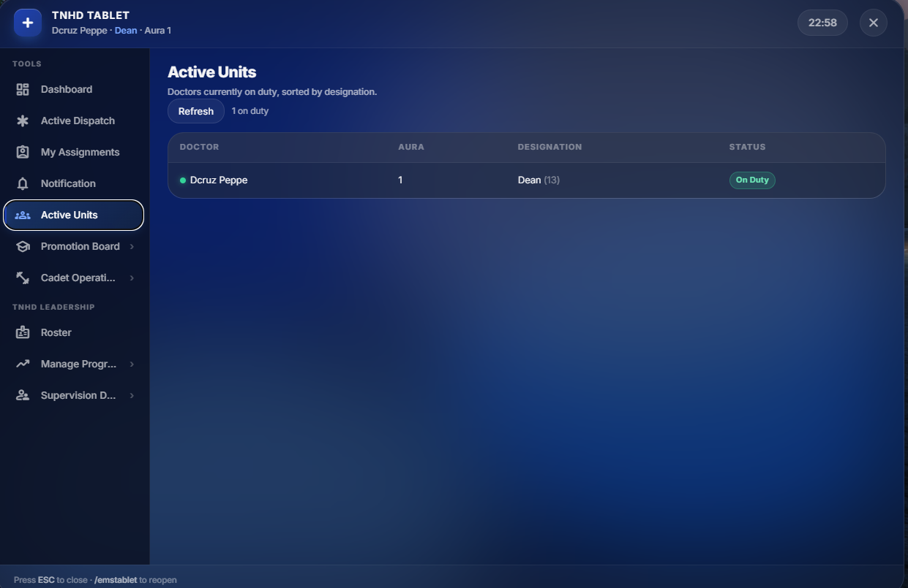

# Doctor Operations Handbook

Official documentation for Thalainagarm Health Department (TNHD).

> 💡 **Important:** Every new doctor should complete this handbook before going on duty.

## Quick Start

1. Open your TNHD tablet
2. Check notifications
3. Go On Duty
4. Monitor Active Dispatch
5. Treat patients professionally

## Workflow

The dashboard is your operational overview.
